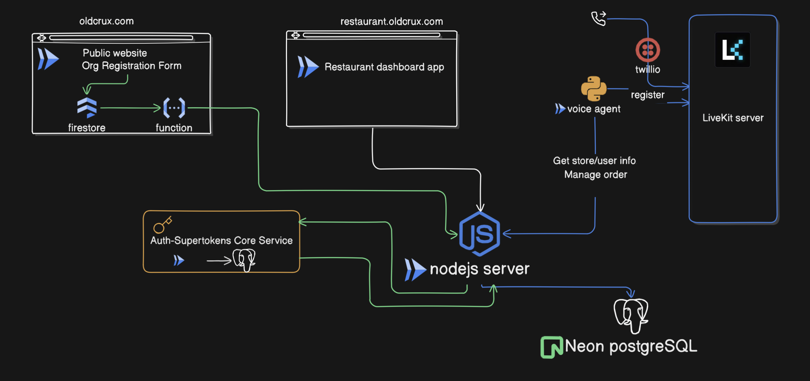

# Restaurant Voice AI Backend


## 🚀 Introduction
A modern **SaaS-ready restaurant management frontend** built for speed, scalability, and simplicity.
This web application connects seamlessly with the [Restaurant Frontend](https://github.com/oldcrux/restaurant_web_app) and [Voice AI Agent](https://github.com/oldcrux/restaurant_ai_voice_agent) to deliver a full-stack experience where:

- Customers can place pickup orders or book appointments effortlessly.
- Staff can manage menus, orders, and reservations in real time.
- Organizations can run multiple stores under a single account.

Built with **production-grade best practices**, this frontend is designed for restaurants of any size — from small local cafés to multi-branch chains — while being **AI-ready** out of the box.


## 🛠️ Tech Stack
- Node.js + Fastify
- SuperTokens (authentication)
- Drizzle ORM + PostgreSQL
- Nodemailer (email)
- Docker (containerization)


## 🏗️ Architecture


Components:
- **Backend API** – Order & appointment lifecycle management.  
- **Auth (SuperTokens)** – Secure user + bot authentication.  
- **PostgreSQL** – Data persistence.  
- **Voice AI Agent** – Calls backend APIs using short-lived bot tokens.  
- **Frontend** – Management & customer-facing UI.  


## ✨ Features
- Multi-organization & multi-store support.  
- Role-based user management.  
- Store-specific & global menu items.  
- Full order lifecycle (CREATED → DELIVERED).  
- Appointment booking lifecycle.  
- Secure API access for bot users.  

### Runtime Characteristics

- Fastify Server – Runs API logic, routes, and middlewares.
- Clustering – Uses `cluster.fork()` to spawn workers equal to number of CPUs for scaling.
- SuperTokens Core – Runs as a separate service (Dockerized, backed by Postgres).
- Postgres DB – Two DBs: one for the application, one for SuperTokens.


## Application Setup and Execution

### Prerequisite
- docker
- nodejs >= 18.0.0
- npm

### Postgresql db setup
I have setup 2 separate databases. 1 for main application and 2nd for supertokens.
Follow the [docker-compose.yml](https://github.com/oldcrux/restaurant_server/blob/main/docker-compose.yml) file.

### Supertokens setup
I created postgres databases in neondb and pointed supertokens to it.  If you need to setup differently, follow official supertokens website. 

### Bring up supertoken container
Note: Make sure docker deamon is running.  Run below command at the root of this application to bring up supertokens container.
```bash
docker compose up -d
```
Run below command to shutdown supertokens container
```bash
docker compose down
```


### Environment variables
```bash
# .env variables and sample values for local environment. Set appropriate values for production environment.

# Server Configuration
HOST=0.0.0.0
NODE_ENV=development

# Database
DATABASE_URL=

# Server
PORT=4000

# Logging
LOG_LEVEL=debug

# CORS Configuration
CORS_ORIGINS=
BASE_URL=http://localhost:4000

# Sample JWT_SECRET value. This must remain same across all application components where a bot user is used. This key must be rotated at a regular interval.
BOT_JWT_SECRET="dRhLcT6UUJ+pByOWre52/pyDkle38YKCcGZ9tLcGZZz0="

EMAIL_HOST=
EMAIL_USER=
EMAIL_PASSWORD=

SUPERTOKENS_CORE=http://localhost:3567
WEBSITE_DOMAIN=http://localhost:3000

```

### Run these commands for the first time
```bash
npm install # This will install the dependant packages for the application
npm run db:push # Push database changes
npm run db:seed # Push seed data

```

### Bring up the application
```bash
npm install
npm run dev
```

Server is available at `http://localhost:4000`

## Security Features
- **Helmet** - Sets various HTTP headers for security
- **CORS** - Configurable Cross-Origin Resource Sharing
- **Rate Limiting** - Basic rate limiting (100 requests per minute)

## Development

The project uses:
- **TypeScript** with strict configuration
- **ESM** modules throughout

## Production

1. Build the project:
   ```bash
   npm run build
   ```

2. Start production server:
   ```bash
   npm start
   ```

## Customization

### Adding New Routes

1. Create a new file in `src/routes/`
2. Define your routes using Fastify plugin pattern
3. Register the plugin in `src/server.ts`

### 🚀 Docker Build and Push for Production Deployment
```bash
npm run build
docker build --no-cache --platform linux/amd64 -t <your repo> .
docker push <your repo>
```

## 📌 TODOs
- Structured logging (pino/winston)
- Observability (metrics, tracing)
- API documentation (Swagger/OpenAPI)
- RBAC based API restriction

